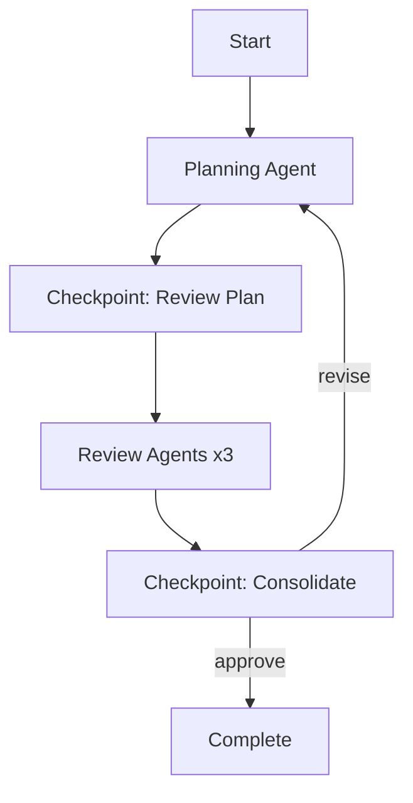

# 🎭 Orchestra

Multi-agent orchestration platform with human-in-the-loop checkpoints for coordinating CLI coding agents.

## Overview

Orchestra provides a web interface for orchestrating multiple AI coding agents (Claude Code, OpenAI Codex, etc.) with mandatory human review checkpoints between agent handoffs. This eliminates the manual copy-paste workflow when coordinating multiple agents.

### Key Features

- **Multi-Agent Workflows**: Coordinate multiple agents in structured workflows
- **Human-in-the-Loop**: Mandatory checkpoints for reviewing and editing agent outputs
- **Real-time Updates**: WebSocket support with automatic reconnection and live workflow monitoring
- **Plan-Review Pattern**: Built-in workflow for iterative planning with multi-agent review
- **Persistent State**: SQLite-based checkpointing for workflow resumption
- **Workspace Integration**: Support for codebase-specific workflows with workspace paths
- **Error Resilience**: React Error Boundary for graceful frontend error handling
- **Type-Safe**: Full TypeScript frontend and Python type hints

## Architecture

```
┌─────────────┐     HTTP/WS      ┌──────────────┐     LangGraph     ┌────────────┐
│   React     │ ←──────────────→ │   FastAPI    │ ←───────────────→ │   Agents   │
│  Frontend   │                  │   Backend    │                   │  (Mocks)   │
└─────────────┘                  └──────────────┘                   └────────────┘
                                         │
                                         ↓
                                  ┌──────────────┐
                                  │   SQLite     │
                                  │  Checkpoint  │
                                  └──────────────┘
```

### Components

- **Frontend**: React + TypeScript + TanStack Query
- **Backend**: FastAPI + LangGraph + AsyncSqliteSaver
- **Agents**: Mock agents (ready for real CLI integration)
- **Database**: SQLite for workflows, checkpoints, and messages

## Quick Start

### Prerequisites

- Python 3.11+
- Node.js 18+
- pip and npm

### Backend Setup

```bash
# Create and activate virtual environment
python -m venv venv
source venv/bin/activate  # On Windows: venv\Scripts\activate

# Install Python dependencies
pip install -r requirements.txt

# Set up environment variables
cp .env.example .env
# Edit .env with your API keys if using real agents

# Initialize database
python -m backend.db.connection

# Run backend server
python -m backend.main
```

Backend will be available at `http://localhost:3030`

API docs: `http://localhost:3030/docs`

### Frontend Setup

```bash
cd frontend

# Install dependencies
npm install

# Run development server
npm run dev
```

Frontend will be available at `http://localhost:5173`

### Running Tests

```bash
# Backend tests (50 tests total)
pytest tests/ -v

# Frontend build test
cd frontend && npm run build
```

## Usage

### 1. Create a Workflow

1. Open `http://localhost:5173` in your browser
2. Fill in the workflow creation form:
   - **Name**: Descriptive name for your workflow
   - **Type**: Select "Plan & Review" for the default workflow
   - **Initial Prompt**: Describe what you want to build
   - **Workspace Path** (optional): Path to your codebase for context-aware workflows

Example prompt:
```
Build a REST API for a todo application with user authentication,
CRUD operations, and PostgreSQL database.
```

### 2. Review Checkpoints

When the workflow reaches a checkpoint, you'll see:

- **Agent Outputs**: Results from planning/review agents
- **Editable Content**: The current plan or implementation
- **Instructions**: What to do at this checkpoint

Actions:
- **Edit** the content directly in the editor
- **Add notes** for the next iteration
- **Approve** to continue
- **Revise** to loop back with changes
- **Reject** to stop the workflow

### 3. Monitor Progress

The dashboard shows:
- Workflow status and metadata
- Agent execution history with timing
- Recent messages and outputs
- Real-time updates via WebSocket

## Workflow: Plan & Review

The default workflow implements an iterative planning process:

1. **Planning Agent** creates initial plan
2. **User Checkpoint** - Review and edit plan
3. **Review Agents** (3) provide feedback in parallel:
   - Architecture Reviewer
   - Security Reviewer
   - Implementation Reviewer
4. **User Checkpoint** - Consolidate reviews
5. Loop back to Planning Agent or approve final plan



## Project Structure

```
orchestra/
├── backend/
│   ├── agents/          # Agent implementations (mock + factory)
│   ├── api/             # FastAPI routes and WebSocket handlers
│   ├── db/              # Database schema and connection
│   ├── models/          # Pydantic models
│   ├── workflows/       # LangGraph workflow definitions
│   ├── config.py        # Configuration management
│   └── main.py          # FastAPI application entry point
├── frontend/
│   ├── src/
│   │   ├── api/         # API client and WebSocket
│   │   ├── components/  # React components
│   │   ├── hooks/       # Custom React hooks
│   │   └── types/       # TypeScript definitions
│   ├── package.json
│   └── vite.config.ts
├── tests/               # Backend test suite (50 tests)
├── data/                # SQLite databases (gitignored)
├── requirements.txt     # Python dependencies
├── pytest.ini          # Test configuration
└── README.md
```

## Configuration

### Backend (.env)

```bash
# Environment
ENVIRONMENT=development

# Database
DATABASE_PATH=data/orchestra.db
LANGGRAPH_CHECKPOINT_DB=data/langgraph_checkpoints.db

# CORS
CORS_ORIGINS=http://localhost:5173,http://localhost:3000

# API Keys (for real agents)
ANTHROPIC_API_KEY=your_key_here
OPENAI_API_KEY=your_key_here
```

### Frontend (vite.config.ts)

Configured to proxy:
- `/api/*` → `http://localhost:3030/api/*`
- `/ws/*` → `ws://localhost:3030/ws/*`

## Development

### Adding New Workflows

1. Create workflow class in `backend/workflows/`
2. Inherit from LangGraph's `StateGraph`
3. Define state schema with `TypedDict`
4. Add nodes and edges
5. Use `interrupt()` for checkpoints
6. Register in `backend/api/workflows.py`

Example:
```python
from langgraph.graph import StateGraph
from langgraph.checkpoint.sqlite.aio import AsyncSqliteSaver

class MyWorkflow:
    async def setup(self):
        self.checkpointer = await AsyncSqliteSaver.from_conn_string(db_path).__aenter__()

    def compile(self):
        graph = StateGraph(MyState)
        graph.add_node("step1", self._step1_node)
        # ... add more nodes
        return graph.compile(checkpointer=self.checkpointer)
```

### Integrating Real CLI Agents

Replace `MockAgent` in `backend/agents/`:

1. Create agent class implementing `AgentInterface`
2. Use subprocess pattern for CLI execution
3. Implement `start()`, `stop()`, `execute()` methods
4. Update `AgentFactory` to create real agents

### API Endpoints

- `GET /health` - Health check
- `POST /api/workflows` - Create workflow
- `GET /api/workflows/{id}` - Get workflow state
- `POST /api/workflows/{id}/resume` - Resume from checkpoint
- `WS /ws/{id}` - WebSocket for real-time updates

Full API documentation available at `http://localhost:3030/docs`

## Testing

### Backend Tests

50 tests across 5 test files:
- `test_models.py` - Pydantic model validation (11 tests)
- `test_agents.py` - Agent system (13 tests)
- `test_database.py` - Database layer (6 tests)
- `test_workflows.py` - Workflow orchestration (9 tests)
- `test_api.py` - REST API endpoints (11 tests)

Run tests:
```bash
pytest tests/ -v
pytest tests/ -v --cov=backend  # With coverage
pytest tests/ -k test_workflow  # Run specific tests
```

### Frontend Build

```bash
cd frontend
npm run build      # Production build
npm run lint       # Code quality check
```

## Contributing

### Recent Enhancements

Phase 1 is now complete! Recent additions include:

- ✅ **Error Boundary**: React Error Boundary component for graceful error handling
- ✅ **WebSocket Improvements**: Enhanced error handling and automatic reconnection logic
- ✅ **Workspace Path Support**: Codebase-specific workflow execution with workspace paths
- ✅ **Comprehensive Test Suite**: 50 tests with 96%+ pass rate

### Phase 2: Future Enhancements

The following features are planned for Phase 2:

- [ ] Real CLI agent integration (Claude Code, Codex, Gemini)
- [ ] Authentication and multi-user support
- [ ] Workflow templates and customization
- [ ] Export workflows to PDF/Markdown
- [ ] Workflow visualization
- [ ] Agent result caching
- [ ] Parallel workflow execution

## License

MIT

## Acknowledgments

Built with:
- [LangGraph](https://github.com/langchain-ai/langgraph) - Workflow orchestration
- [FastAPI](https://fastapi.tiangolo.com/) - Backend framework
- [React](https://react.dev/) - Frontend framework
- [TanStack Query](https://tanstack.com/query) - Data synchronization
